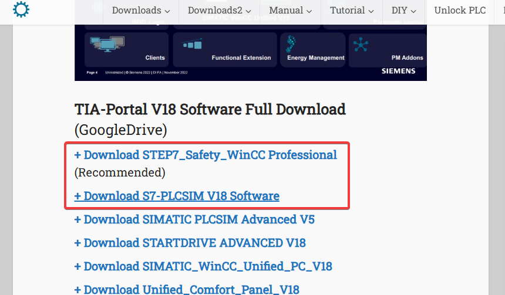

# TIA Portal Project with installation guide

This repository contains my first TIA Portal project, along with detailed instructions for setting up the environment and downloading required software in the correct order.  
I must say that its been a while of several trials and fails this is the installation procedure that worked correctly for me.   
Due to lack of correct procedure online i decided to document mine to help those who realy need the software and don't know how to get it.  
The app is seamless and it should be also for you if you follow the given procedures.

---

## 🚀 Installation Steps

Below is the chronological order of installations to get your project environment fully set up.

---

### 1️⃣ Install TIA License Manager

Before installing TIA Portal itself, you need to install the TIA License Manager to manage the licenses.

👉 **Download TIA License Manager here:**
- [TIA License Manager Download (Siemens )](https://drive.google.com/file/d/1X3K36oxB-y9v3Eau-DYXfYvjYCCMZnti/view)

#### **Illustration:**

---

### 2️⃣ Install TIA Portal

Now, proceed to install the TIA Portal software.

👉 **Download TIA Portal from one of the links below:**
- [TIA Portal V18 (Recommended Download)](https://plc4me.com/download-tia-portal-v18-full-googledrive/)
- [TIA Portal V18 (Alternative Download )](https://plc247.com/download-tia-portal-v18-full-video-installation/)

#### **Illustration:**

Download and install the two highlighted in a red box and follow the instructions provided on the web page.  
If need of the **Siemens start dirives** ( Optional ) download and insall 
**+Download STARTDRIVE ADVANCED V18**

---

### 3️⃣ Install Factory IO (Optional)

After installing TIA Portal, you can install Factory IO to simulate your automation project in a 3D environment.

👉 **Download Factory IO from one of these links:**
- [Factory IO Download (Recommended)](https://plc247.com/?s=Factory+IO)
- [Factory IO Download (Alternative )](https://plc4me.com/?s=Factory+IO)

#### **Illustration:**

Click on the download version shown above and follow the instructions on the web page for correct installation.  
Note you can also use other versions for other TIA portal installations just search first which versions of Factory IO is compartible with your TIA portal installation.

---

## 📁 Project Overview

This repository includes:
- TIA Portal project files
- Basic ladder logic and configuration
- Notes for future improvements

---

## 🛠️ Requirements

- Windows 10/11
- 8GB RAM minimum
- At least 20GB free disk space
- A core i5 plus pc

---

## 💡 Usage

After installation, clone my project and  open the TIA Portal project file (`.ap18`) and run the simulation or test with Factory IO for visual verification.  
You can also open a new project add a device and open the program block to test the installation.

---

## 🤝 Contributing

If you’d like to contribute to improving this project or have other useful resources to add, please open a pull request!

---

## 📒 Note

👉  The above is a basic for TIA portal version 18 installation !.. The same procedure can be applied for any other versions you may want. You can just search the version from the serch box of the provided link and follow installation guide.  
TIA Potal install can be abit frustarting i must say ... just make sure you follow the instructions correctly with patience and make sure you troubleshoot the errors that may occur during installation.  
In case of anything you can also contact me for technical support if need be via my email indicated below.

---

### 📫 Contact

For questions or collaboration, feel free to open an issue or contact me directly! at muigaidavie6@gmail.com

---

Happy PLC programming! 🚀

